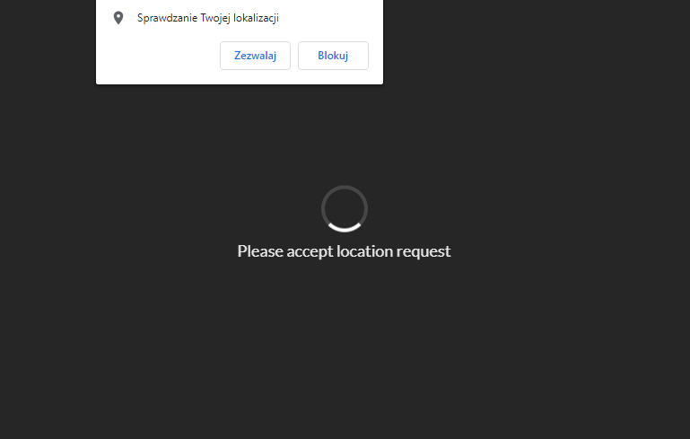
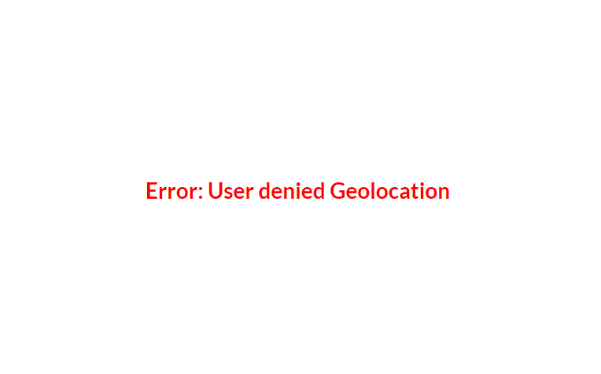
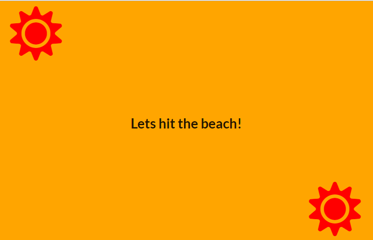
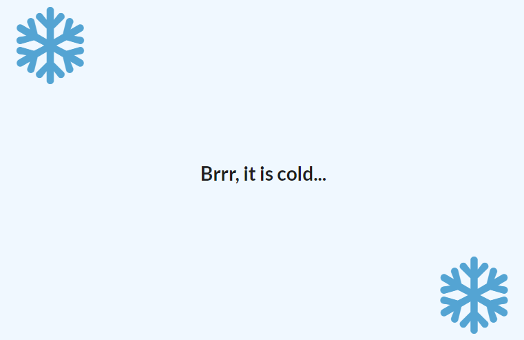

Using:
* Mozilla Developer’s Network (MDN) Geolocation API
* Semantic UI 

  
Prompts user for their location:
* show loading spinner while awaiting user decision

* if user declines, show error message:

* if user accepts determine whether to show snowflakes (winter) or sun (summer) depending on whether user is in southern hemisphere or northern hemisphere in a specific month.
 

