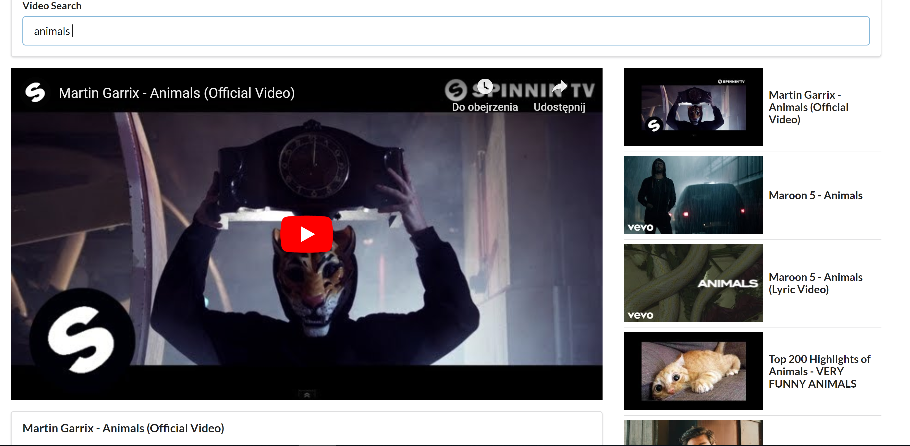

Youtube videos project using:

* YouTube Data API
* Renderng video players
* CSS (positioning main video player + thumbnails)

When opening for first time you'll see default search result for "buildings".

You can also enter any other word into search bar and get top videos from YouTube Data API related to term you're searching for. Clink on video you like and enjoy watching it directly from that project (no need to go YouTube ;)

